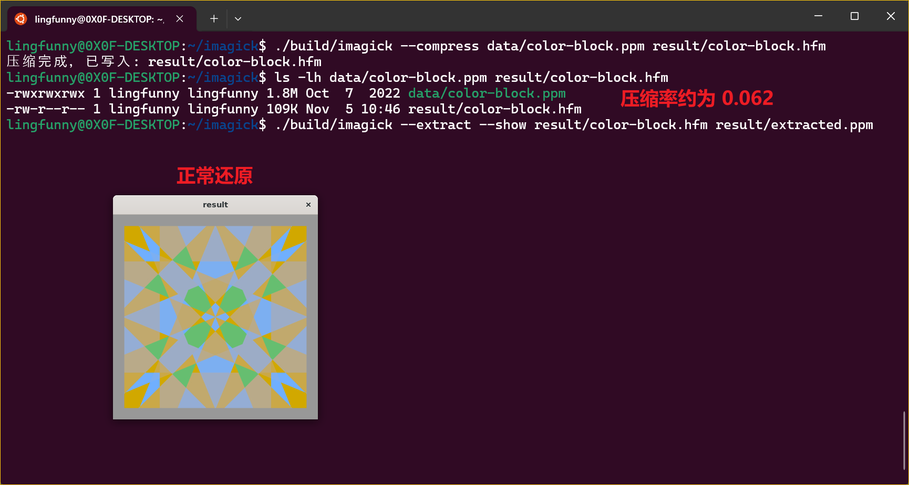
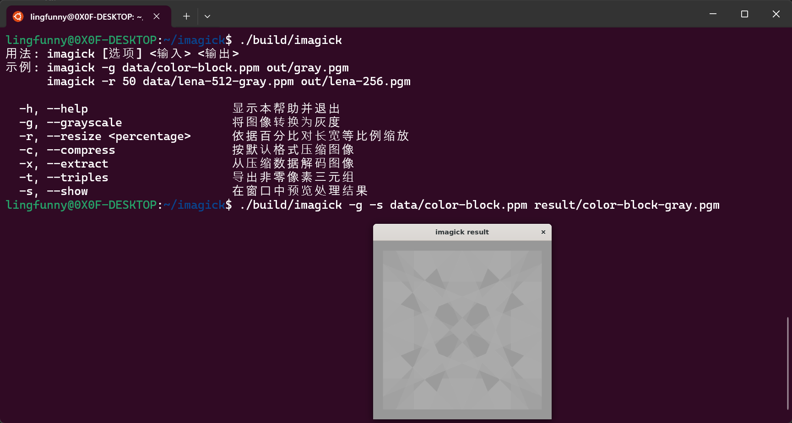
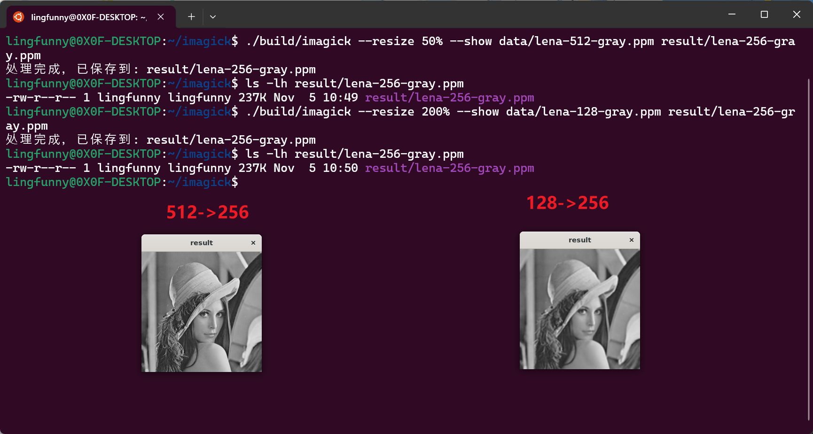

# Project 2 - 1 实验报告（简单图像处理程序）

- 学号 24344064
- 姓名 廖海涛
- 项目地址 [https://github.com/lingfunny/imagick](https://github.com/lingfunny/imagick)

[TOC]

## 程序功能简要说明

实现了类似命令行指令的解析，类似 ImageMagick。支持对图像的简单操作。

```bash
用法: imagick [选项] <输入> <输出>
示例: imagick -g data/color-block.ppm out/gray.pgm
      imagick -r 50 data/lena-512-gray.ppm out/lena-256.pgm

  -h, --help                     显示本帮助并退出
  -g, --grayscale                将图像转换为灰度
  -r, --resize <percentage>      依据百分比对长宽等比例缩放
  -c, --compress                 按默认格式压缩图像
  -x, --extract                  从压缩数据解码图像
  -t, --triples                  导出非零像素三元组
  -s, --show                     在窗口中预览处理结果
```

## 程序运行截图

压缩功能展示：



转为灰度图功能展示：



缩放功能展示：



## 部分关键代码及其说明

### 命令解析

利用 `main(int argc, char** argv)` 函数的参数得到用户给出的参数。之后对于每个指令参数，逐一解析。对于非指令参数，视为文件参数。可以得到指令序列。

```cpp
CLIConfig parseArguments(int argc, char** argv) {
    if (argc <= 1) {
        printUsage(std::cout);
        std::exit(EXIT_SUCCESS);
    }

    CLIConfig config;
    /*
     * config.operations 存储操作序列
     * config.inputPath 存储输入文件路径
     * config.outputPath 存储输出文件路径
     */
    std::vector<std::string> positional;    // file path parameters

    for (int i = 1; i < argc; ++i) {
        std::string arg = argv[i];

        if (arg == "--help" || arg == "-h") {
            printUsage(std::cout);
            std::exit(EXIT_SUCCESS);
        }

        if (!arg.empty() && arg[0] == '-') {
            OperationType type = parseOperationToken(arg);
            std::string parameter;
            if (operationRequiresArgument(type)) {
                if (i + 1 >= argc) {
                    throw std::runtime_error(arg + " 需要参数");
                }
                parameter = argv[++i];
            }
            config.operations.push_back({type, parameter});
            continue;
        }

        positional.push_back(arg);
    }

    if (positional.empty()) {
        throw std::runtime_error("请指定输入文件路径");
    }
    if (positional.size() > 2) {
        throw std::runtime_error("请指定输入文件路径和输出文件路径");
    }

    config.inputPath = positional.front();
    config.outputPath = positional.back();

    return config;
}
```

### 图像展示

调用 opencv 库函数 `cv::imshow` 展示图像。需要注意 opencv 使用 BGR 通道顺序，而程序中使用 RGB 通道顺序存储彩色图像，因此需要进行转换。

```cpp
void showImage(const cv::Mat& image, const std::string& windowTitle) {
    if (image.empty()) {
        throw std::runtime_error("无法展示空图像");
    }
    cv::Mat converted;
    const cv::Mat* toDisplay = &image;
    if (image.channels() == 3) {
        cv::cvtColor(image, converted, cv::COLOR_RGB2BGR);
        toDisplay = &converted;
    }
    cv::namedWindow(windowTitle, cv::WINDOW_AUTOSIZE);
    cv::imshow(windowTitle, *toDisplay);
    cv::waitKey(0);
    cv::destroyWindow(windowTitle);
}
```

### 灰度化

在 [ImageOps.cpp](src/ImageOps.cpp) 中实现。调用 opencv 库函数 `cv::cvtColor` 进行颜色空间转换。使用公式 \(Y = 0.299 R + 0.587 G + 0.114 B\) 进行灰度化。

```cpp
cv::Mat toGrayscale(const cv::Mat& image) {
    if (image.channels() == 1) {
        return image.clone();
    }
    if (image.channels() != 3 || image.depth() != CV_8U) {
        throw std::runtime_error("仅支持 8 位三通道彩色图像转换为灰度");
    }

    cv::Mat gray;
    cv::cvtColor(image, gray, cv::COLOR_RGB2GRAY);
    return gray;
}
```

### 图像缩放

在 [ImageOps.cpp](src/ImageOps.cpp) 中实现。调用 opencv 库函数 `cv::resize` 进行图像缩放。默认使用双线性插值。

```cpp
cv::Mat scaleByPercentage(const cv::Mat& image, double scale, int interpolation) {
    if (image.empty()) {
        throw std::runtime_error("无法缩放空图像");
    }
    if (scale <= 0.0) {
        throw std::runtime_error("缩放比例必须大于 0");
    }
    if (scale == 1.0) {
        return image.clone();
    }

    cv::Mat result;
    cv::resize(image, result, cv::Size(), scale, scale, interpolation);
    return result;
}
```

### 图像读写

在 [ImageLoader.cpp](src/ImageLoader.cpp) 中实现。对于 P2, P3 格式直接输出 ASCII 码，对于 P6 格式需求二进制输出。

```cpp
void writeAscii(const cv::Mat& image, std::ostream& os, int /*maxValue*/, bool isColor) {
    // write ASCII format PPM/PGM image
    const int width = image.cols;
    const int height = image.rows;

    if (isColor) {
        for (int row = 0; row < height; ++row) {
            for (int col = 0; col < width; ++col) {
                const auto pixel = image.at<cv::Vec3b>(row, col);
                os << static_cast<int>(pixel[0]) << ' '
                   << static_cast<int>(pixel[1]) << ' '
                   << static_cast<int>(pixel[2]) << '\n';
            }
        }
    } else {
        for (int row = 0; row < height; ++row) {
            for (int col = 0; col < width; ++col) {
                os << static_cast<int>(image.at<std::uint8_t>(row, col)) << ' ';
            }
            os << '\n';
        }
    }
}
```

```cpp
void writeBinaryP6(const cv::Mat& image, std::ostream& os) {
    // write binary P6 format PPM image
    if (image.type() != CV_8UC3) {
        throw std::runtime_error("二进制 P6 输出仅支持 8 位 3 通道图像");
    }
    const std::size_t total = static_cast<std::size_t>(image.total()) * image.elemSize();
    os.write(reinterpret_cast<const char*>(image.data), static_cast<std::streamsize>(total));
}
```

### 图像压缩

在 [ImageLoader.cpp](src/ImageLoader.cpp) 中实现。

首先为了利用图像局部相关性，将所有像素对其左侧数字做差分，而对于不同通道独立处理。实现函数 `std::vector<std::uint8_t> buildResidualChannel(const cv::Mat& image, int channel)` 和 `std::vector<std::uint8_t> reconstruct(const std::vector<std::uint8_t>& residuals, int width, int height)`。

考虑到差分后数字出现频率差距悬殊，使用 Huffman 编码进行无损压缩。

首先统计各种数字出现频率，实现 `std::array<std::uint64_t, 256> buildHistogram(const std::vector<std::uint8_t>& data)`。然后对其建立 Huffman 树。为了方便编码，考虑求出规范哈夫曼码字长度，实现 `std::array<int, 256> buildCodeLengths(const std::array<std::uint64_t, 256>& histogram)`。最后根据码字长度生成具体编码，实现 `HuffmanTable buildCanonicalTable(const std::array<std::uint8_t, 256>& lengths)`。

读写只需要按照指定的文件规范操作即可：

```cpp
/*
 * Compression format:
 * [magic "HFM" (3 bytes)]
 * [width (4 bytes)]
 * [height (4 bytes)]
 * [maxValue (2 bytes)]
 * [channels (1 byte)]
 * [Huffman tables (256 bytes each channel)]
 * [dataBitCount (4 bytes)] [encoded data (variable)]
 */
```

## 程序运行方式

编译程序：

```bash
cmake -S . -B build
cmake --build build
```

可对程序使用 `--help` 指令获取使用说明。